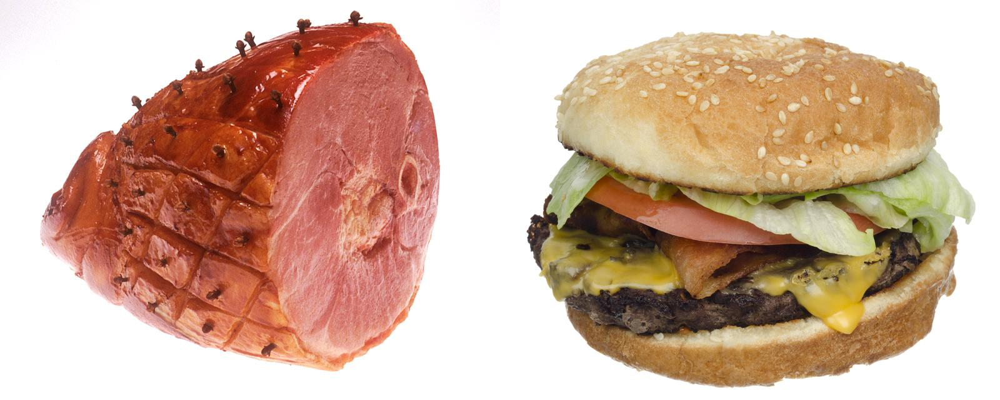
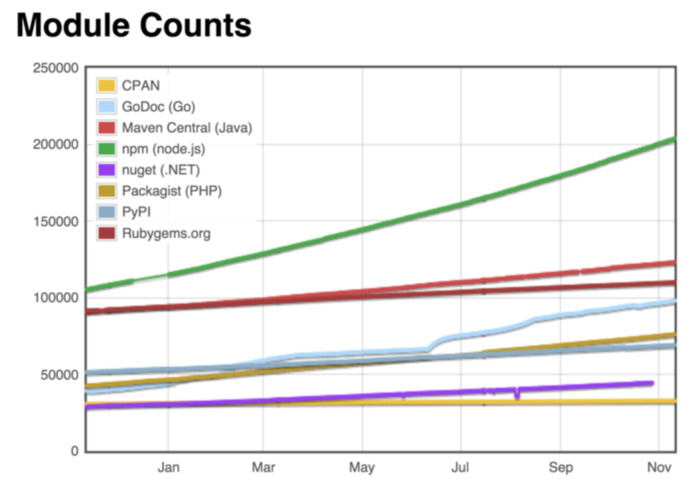

% JavaScript Mandatory Fun!
% Cosmin Dumitru
% 11 November 2015


Vanity Slide
--------------------

Cosmin 'cosu' Dumitru

* OS3 alumni  2009 - 2010
* PhD Student in the SNE group 2010 - 2015
* Consultant - Software Improvement Group

This talk
--------------------

* High level overview of JavaScript  and some related concepts
* JavaScript ecosystem: node, databases
* You will not be an expert in JavaScript by the end of it
    * unless you already are :)
* Main goal: arouse your curiosity


Java vs JavaScript
--------------------



Why should you care
--------------------
* Everywhere - (almost) any browser!
* It’s easy (and it’s becoming easier)
* Powerful (functional, async support, high performance)
* You’ll have to anyway


GitHut
--------------------


Origins
--------------------
* created by Brendan Eich in 10 days - Mocha (May 1995) 
* LiveScript (September 1995) 
* JavaScript (December 1995)
* Released with Netscape Navigator 2.0
```JavaScript
navigator.appName
> "Netscape"
```

ECMAScript
--------------------
* The language  specification ( June 1997)
* Implementations
    * JavaScript - most popular
    * ActionScript 3 -  ES4 + extensions
    * JScript -  Microsoft

ECMAScript (2)
--------------------

* ECMAScript Version 3 - Dec. 1999
* ECMAScript Version 4 - abandoned due to political differences
    * 2005 - Jesse James Garrett writes the Ajax [white paper](http://adaptivepath.org/ideas/ajax-new-approach-web-applications/)
* ECMAScript Version 5 (or 3.1) - Dec. 2009
    * 'strict mode' to prevent common error constructs
* ECMAScript Version 6 - June 2015
    * classes, modules, generators, collections

JavaScript
--------------------
* ["The world's most misunderstood programming language"](http://www.crockford.com/javascript/javascript.html)
* Structured
    * `if , for, while`, code blocks
* Dynamic
    * most type information at runtime
* Functional
    * programming done by evaluating expressions
* Prototype based
    * reusing is done by cloning existing objects


Syntax
--------------------
```JavaScript
function countWords(input) {
    var count = 0;
    for (var i=0; i < input.length; i ++) {
        if (input.charAt(i) === ' ') 
        count++;
    }
    return count + 1;
}

> countWords('all your base are belong to us!')
> 7

```

Language Types
--------------------
* Dynamic typing - variable types are not declared
```JavaScript
var x = 0; // Number
x = "foo"; // String
x = Symbol("foo"); // new in ES6
x = false; // Boolean
x = null // Null
x = undefined // Undefined
x = {}; // Object - not a privimite type
```


Numbers
--------------------
- IEEE 754 format - 64 bit floating point
- No Integer type
```JavaScript
var x = 0.1 + 0.2;
> 0.30000000000000004
```
- Read [What Every Computer Scientist Should Know About Floating-Point Arithmetic](http://docs.oracle.com/cd/E19957-01/806-3568/ncg_goldberg.html)

Objects
--------------------
- Collection of properties
- Created using the `Object` contructor or the `{}` literal
- Properties = Keys (Names) and Values
- Keys can be Strings and Symbols
- Values can be of any type
```JavaScript
var shirt = {};
shirt.size = 'LARGE'
shirt['size']
> [ 'LARGE' ]
```

Arrays
--------------------
* List-like objects
* Created using the `Array` contructor or the `[]` literal
```JavaScript
var arr = ['foo', 'bar'];
arr.length
> 2
arr[0]
> 'foo'
arr.push('baz')
> [ 'foo', 'bar', 'baz' ]
```

Truthy
--------------------
* all of these are equivalent
```JavaScript
if (true)
if ({})
if ([])
if (42)
if ("foo")
if (new Object())
```

Falsy
--------------------
* all of these are equivalent
```JavaScript
if (false)
if (null)
if (undefined)
if (0)
if (NaN)
if ('')
if (document.all) // srsly
```


Operators
--------------------
* Arithmetic : `+ - * / % ++ -- `
* Assignment : `+= -= *= /= %= `
* Logical: `&& || `
* Compaison
    * Javscript performs automatic type coercion!
    * `== !=` equal (value only)
    * `=== !==` strict equal (type and value)
```JavaScript
2 == '2' // true
2 === '2' // false
1 == true //true
1 === true // false
"a" === new String("a") // false
//string vs Object
```

Functions
--------------------
* Logical units that implement a piece of functionality and always return a value
* Arguments are passed by value for primitive types
```javascript
function censor(text) {
// all characters become #
  text = text.replace(/\w/g,"#"); 
  return text;
}
var password = "foo"
console.log(censor(password));
console.log(password);
> '###'
> 'foo' // password is unchanged
```

Functions(2)
--------------------
* Arguments are passed by reference for object types
```javascript
function censor(user) {
  user.password = user.password.replace(/\w/g,"#");
  return user;
}
var user = {password: 'foo'};
console.log(censor(user).password);
console.log(user.password);
> '###'
> '###' // password is changed
```


Functions (3)
--------------------
* first class objects - can be passed arround like any other type

```javascript
function add(a,b){
    return a + b
}

function mul(a,b) {
    return a*b;
}

function compute(a,b, f){
    return f(a,b);
}

compute(6,7,mul);
> 42
compute (6,7, add)
> 13
```


Scope
--------------------
* Only functions can create a new scope - function-level scope
* Scope is defined statically - lexical scoping

```javascript
var x = 'spam'; // global scope

function bar () {
    var x = 'eggs'; // local scope
    console.log(x);
    foo();
}
function foo(){
    console.log(x); // from global
}
bar()
> 'eggs'
> 'spam'
```


Function-Level Scope
--------------------

```javascript
function foo(){
    console.log(i);

    for (var i = 0; i < 10; i ++) {
        // bla
    }
    console.log(j);
}

foo();

undefined
ReferenceError: j is not defined
```


Scope and Hoisting
--------------------
* First variables are declared but not initialized
* Functions are 'hoisted'

```javascript
var x = 42;
function foo() {
    bar();
    if (!x) { // x === undefined
        var x = 0;
    }
    function bar(){
        console.log(x);
    }
    console.log(x);
}

foo();

undefined
> 0
```

Closures
--------------------
* Function definition + enviroment

```javascript

function foo(){
    var x = 42;
    function bar(){
        console.log(x);
    }
    return bar;
}

var baz = foo();
baz() // bar holds a reference  to foo's scope

> 42
```


Closures (2)
--------------------

* Module pattern - private variables

```JavaScript
function myCounter(){
  var counter = 0;
  return {
    inc: function () {
      return counter++;
    },
    reset: function () {
      console.log( " reset: " + counter);
      counter = 0;
    }
  }
}
var c = myCounter()
c.inc();
c.reset();
> reset: 4
```

Inheritance
--------------------
* ~~JavaScript has no classes~~
* ES6 adds syntactic sugar for classes
* Prototype chain - objects are linked to their "prototype"

```JavaScript
var a = { x : 1 };
var b = Object.create(a); //link b to a

b.x // shadowing a.x
> 1

b.x = 2  // override with own implementation
a.x
> 1

a.y = 42;
b.y // delegate to the protoptype
> 42

```

Callbacks
--------------------
* A function passed to another function as parameter


```JavaScript
$('#button').on('click',function(){
  $.get("https://api.github.com", function(response){
    console.log(response);
  });
});
```


Event Loop
--------------------
* single threaded processing
* run-to-completion
* never blocking - IO operations take place in the background
```JavaScript
while ( true ) {
  work = queue.take();
  process(work);
}
```
* [Event loop visualized](http://bit.ly/1PkfuKP)


"Pyramid of Doom"
--------------------
* aka [Callback Hell](http://callbackhell.com/)

```JavaScript
var query = {..}
Service.logIn("user", "pass", {
  success: function(user) {
    query.user = user.id;
    query.find({
      success: function(results) {
        results[0].save({ credit:  42}, {
          success: function(result) {
            console.log("save success")
          }
        });
      }
    });
  }
}); // it can get worse
```


Promises
--------------------
* Promise = eventual result of an async operation
* Pending -> Fulfilled or Rejected
* Pipelining and better structuring of callbacks


Promises(2)
--------------------
* [Demo](http://jsbin.com/dinalitese/edit?js,console,output)

```JavaScript
var apiUrl = "https://api.github.com/search/repositories?q=promise&sort=stars&order=desc";
var jQueryPromise = $.get(apiUrl);
//wrap jquery ...
var realPromise = Promise.resolve(jQueryPromise);

realPromise
    .then(function(response) {
      return response.total_count;
    })
    .then(function(count) {
        console.log("Found " + count + " GitHub repos searching 'promise'");
    })
    .catch(function(err) {
      console.log("failed call");
    });
```


JSON
--------------------
* JavaScript Object Notation
* Data objects - key, value pairs
* [Demo](http://jsbin.com/basububeyi/edit?html,js,console,output)

```json
{
    'price': 1000,
    'description': 'Item1'
    'type': 'bike'
    'created': 1447192495275
}
```

JavaScript Engines
--------------------
* v8 - OSS JavaScript engine
    * Chrome, Node.js
* SpiderMonkey - Mozilla
* Chakra - Used in IE
* Nashhorn - embedded in Oracle JDK
* JavaScriptCore - used in Safari
* Others


Node.js
--------------------
* Server side JavaScript using V8
* Event driven, non blocking
* Modules for IO, binary handling, crypto


Node.js - Sync
--------------------
```javascript
var http = require('http');
var fs = require("fs");

var server = http.createServer(function (request, response) {
  response.writeHead(200, {"Content-Type": "text/plain"});
  var data = fs.readFileSync('content.txt');
  response.end(data+"\n");
}).listen(8000);

console.log("Server running at http://127.0.0.1:8000/");
```

Node.js - Async
--------------------
```javascript
var http = require('http');
var fs = require("fs");

var server = http.createServer(function (request, response) {
  fs.readFile('content.txt', function(err, data){
    response.writeHead(200, {"Content-Type": "text/plain"});
    response.end(data+"\n");
  });

}).listen(8000);

console.log("Server running at http://127.0.0.1:8000/");
```

NPM
--------------------
*  Node package manager
```bash
npm install jslint
```
* package.json - versions of dependencies, metadata
```json
{
  "name" : "foo",
  "version" : "0.0.0",
  "dependencies": {
      "bar": "1.0.42",
  },
}
```


ModuleCounts
--------------------



MongoDB
--------------------
* embedded V8 engine
* uses BSON (binary JSON) to store documents
* Interaction and administration via JS Shell
```javascript
var itemsInUSD = db.find({
  'price':{'$gt':100}
  })
  .map(function(item){
   item.price = 1.04 * item.price;
   return item;
  });
```


Other topics not covered
--------------------
* `this, bind, call, apply`
* Implementing classes
* Execution contexts
* Put effort into understanding them! (see refs.)


Transpilers
--------------------
* 'JavaScript is the Assembly Language of the Web'
* Emscripten - LLVM to JavaScript
* asm.js / WebAssembly
    * low level
    * high performance


CoffeeScript
--------------------
* syntactic sugar for JavaScript
* shorter, more concise code

```JavaScript
//JavaScript
var mul = function(a,b){
    return a*b;
}
//CoffeeScript
mul = (a,b)-> a*b
```

Dart
--------------------
* Classes, type annotations, async/await
* Familiar syntax
* dart2Js / Dartium / Standalone
* Targets for mobile, desktop and system applications

Dart (2)
--------------------
```JavaScript

import 'dart:math' show Random;

class Vm {
  static final Random idGen = new Random();
  String _templateName;
  int id;
   Vm(String templateName) {
     _templateName = templateName;
     id = idGen.nextInt(100);

  }
  String toString() => "$_templateName-$id";

}

void main() {
  for (int i = 0; i < 5; i++) {
    var vm = new Vm("foo");
    print(vm.toString());
  }
}

```

TypeScript
--------------------
* Classes, type annotations, async/await
* Superset of JavaScript
* Transpiles to ES6


TypeScript (2)
--------------------
```javascript
class Vm {
    private templateName: string;
    private id: number;
    constructor(templateName: string) {
        this.templateName = templateName;
        this.id = Math.floor(Math.random() * 100);
    }
    toString(): string {
        return `${this.templateName}-${this.id}`;
    }
}

for ( var i = 0; i < 5; i++) {
    var vm = new Vm("foo");
    console.log(vm.toString());
}
```

Other cool things
--------------------
* Flow - static type checker
```javascript
function mul(a, b){
    return a*b;
}
mul ("foo", "bar"); // NaN
```
* [Scala.js](www.scala-js.org) - write scala and compile to JavaScript
* [Babel.js](babeljs.io) - Use future features now!
    * TypeScript -> ES6 -> Babel -> ES5
* Data visualization - [Crossfilter](http://square.github.io/crossfilter/)


Some resources
--------------------
* [Crockford on Javascript](http://www.crockford.com/javascript/)
* [You Don't know JS](https://github.com/getify/You-Dont-Know-JS)
* [Pro Javascript](https://www.outlearn.com/topic/javascript)
* [Speaking JavaScript](http://speakingjs.com/es5/)
* [Javascript Alonge](https://leanpub.com/javascript-allonge/read)
* [Exploring ES6](http://exploringjs.com/)
* [Essential JavaScript Links](https://github.com/ericelliott/essential-javascript-links)


# Thank you!


